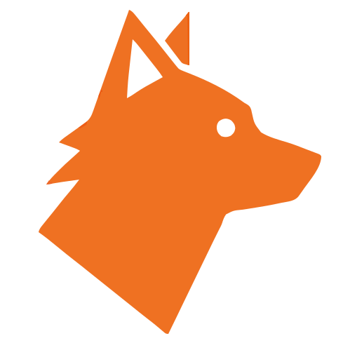

<p align="center">

</p>

# WolfLang

WolfLang is a Lua-inspired, embeddable, statically-typed programming language.
It’s designed for scripting, quick prototyping, and embedding in larger applications.

## Features (so far)
- **Embeddable**: Can be integrated into other projects easily
- **Static typing**: Helps catch errors at compile time
- **Lua-like syntax**: Familiar and easy to learn
- **Control Flow**: if, while statements

## Examples
**print**

```rust
print "hello world"
```
**Variables**:

```rust
let string message = "hello world"
print message
```
**If statement**

```rust
let number x = 10
if x > 5
   print "x is greater than 5"
end
```
**While loop**

```rust
let number counter = 0
while counter < 3
   print "hello world"
end
```

**For loop**

```rust
for int i = 1 range 10
   print "hello world"
end
```

## Planned Features
- Control flow: `if`, `while`, `for`
- User-defined functions and lexical scoping
- Lists, maps/dictionaries, modules
- Coroutines / async support
- FFI: Call C/Rust functions directly
- Optional transpiler: Convert WolfLang to Lua or C

## Getting Started
1. Clone the repository
2. Build the interpreter
3. Run the ```cargo run -- --file test.wolf ```

> **Note:** This is an early-stage project and currently private. Features and syntax are under active development.

