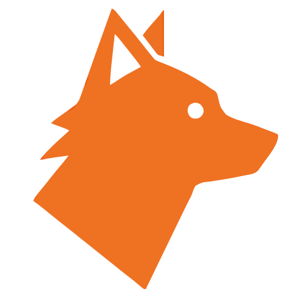

<p align="center">
  
</p>

# 🐺 WolfLang

> **A Lua-inspired, embeddable, statically-typed programming language written in Rust.**

[](https://opensource.org/licenses/MIT)
[](https://www.rust-lang.org/)
[]()

WolfLang is designed for **scripting**, **quick prototyping**, and **embedding** into larger applications (like Game Engines). It combines the simple syntax of Lua/Ruby with the safety of static typing and the performance of Rust.

---

## ✨ Features (v0.1)

- 📦 **Embeddable Architecture:** Designed to be used as a crate in Rust projects.
- 🧠 **Smart Memory Management:** Scope-based memory handling with no garbage collector lag.
- 🔄 **Recursion Support:** Full support for recursive functions.
- 🎒 **Dynamic Arrays:** Create, index, and mutate lists (`push`, `pop`, `len`).
- 🔌 **Rust Interop:** Call Rust functions from WolfLang and vice versa.

---

## 🚀 Getting Started

### 1. Installation (CLI)
To run WolfLang as a standalone interpreter:

```bash
# Clone the repository
git clone [https://github.com/islamfazliyev/Wolf-Lang.git](https://github.com/islamfazliyev/Wolf-Lang.git)

# Build in release mode (Recommended for speed)
cargo build --release

# Run a script
./target/release/wolflang --file examples/text_game.wolf ```
```

### 1. Embedding in rust (CLI)
Add WolfLang to your Cargo.toml:

```toml
[dependencies]
wolflang = { git = "[https://github.com/islamfazliyev/Wolf-Lang.git](https://github.com/islamfazliyev/Wolf-Lang.git)" } 
```

Use it in your Rust code:

```rust
use wolflang::WolfEngine;

fn main() {
    let mut engine = WolfEngine::new();
    
    // Pass data to WolfLang
    engine.push_int("player_hp", 100);

    let script = r#"
        print "Current HP: ", player_hp
        player_hp = player_hp - 10
    "#;

    engine.run(script).unwrap();
    
    // Get data back from WolfLang
    let new_hp = engine.get_int("player_hp").unwrap();
    println!("HP from Rust: {}", new_hp); // 90
}
```

## 📖 Syntax Tour

Variables & Types:
```rust
let name: string = "WolfLang"
let version: int = 1
let pi: float = 3.14
let is_fast: bool = true
```

Arrays
```rust
let inventory: list<string> = ["Sword", "Shield"]

# Methods
inventory.push("Potion")
print inventory[0] # Output: Sword

let item: string = inventory.pop()
print "Used: " + item
```
Control Flow

```rust
if version >= 1
   print "Ready for release!"
end
if version < 1
   print "Still in beta..."
end

let i: int = 0
while i < 5
   print i
   i = i + 1
end

for int i = 0 range 10
   print i
end
```

Functions & Recursion

```rust

fn fibonacci(n: int)
   if n <= 1
      return n
   end
   return fibonacci(n - 1) + fibonacci(n - 2)
end

print fibonacci(10) # Output: 55
```
check the docs for more information:

[](https://islamfazliyev.github.io/wolflang-docs/)

### 🗺️ Roadmap

[x] v0.1 (Current): Core Logic, Functions, Arrays, Embedding API.
[ ] v0.2 (Next): Structs, Maps (Dictionaries), Standard Library (Math/IO).
[ ] v0.3: Bytecode VM for higher performance.

### 🤝 Contributing

This is an early-stage project developed by a solo developer. Issues, pull requests, and feedback are highly welcome!

**Developed by islam şahin**
